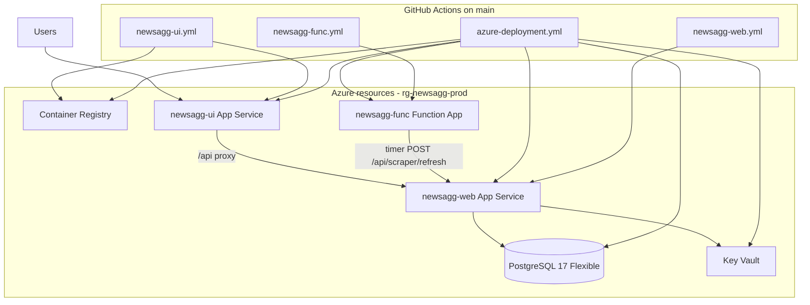

# Azure full-stack setup plan

End-to-end guide to deploy News Aggregator to Azure: PostgreSQL, Key Vault, API, timer function, and React UI.

## Architecture



| Layer | Azure resource | Deployed by |
|-------|----------------|-------------|
| Database | PostgreSQL Flexible Server (`newsaggpg`) | `azure-deployment` / Bicep |
| Secrets | Key Vault (`newsaggkv`) | Bicep |
| Backend API | App Service `newsagg-web` (.NET 10) | `newsagg-web.yml` |
| Scraper timer | Function App `newsagg-func` (Python 3.13) | `newsagg-func.yml` |
| Frontend | App Service `newsagg-ui` (nginx + React container) | `newsagg-ui.yml` |
| Images | ACR `newsaggacr` | Bicep + `newsagg-ui.yml` |

**Public URLs (default prefix `newsagg`):**

| Service | URL |
|---------|-----|
| **SPA (primary)** | https://newsagg-ui.azurewebsites.net |
| API (direct) | https://newsagg-web.azurewebsites.net |
| Function host | https://newsagg-func.azurewebsites.net |

---

## Prerequisites

### Azure

- Active subscription with permission to create resource groups, App Service, PostgreSQL, ACR, Key Vault
- Region: **newzealandnorth** (default in Bicep and workflows)
- Sufficient quota for Basic App Service plan (B1) and Burstable PostgreSQL (B1ms)

### Local (optional bootstrap)

- [Azure CLI](https://learn.microsoft.com/cli/azure/install-azure-cli) — `az login`
- [Azure Developer CLI](https://learn.microsoft.com/azure/developer/azure-developer-cli/install-azd) — `azd` for local provision

### GitHub

- Repository on GitHub with `main` branch
- Admin access to **Settings → Secrets and variables → Actions**
- Environment **newsagg-production** (for infra workflow)

---

## Phase 1 — Azure identity (OIDC)

Use **one** service principal for infra + UI, and **per-app** federated credentials for web/func (as generated by Azure Deployment Center), **or** consolidate all workflows onto a single SP with Contributor on the resource group.

### 1a. Infra + UI service principal (recommended)

1. Create an **App registration** (or use existing) in Microsoft Entra ID.
2. Create a **client secret** only if not using federated credentials (workflows use OIDC, not secrets).
3. Add **Federated credential** (GitHub Actions):
   - Issuer: `https://token.actions.githubusercontent.com`
   - Subject: `repo:<ORG>/<REPO>:environment:newsagg-production` (for infra)
   - Additional credential for UI if repo-level: `repo:<ORG>/<REPO>:ref:refs/heads/main`
4. Assign **Contributor** (or narrower: resource group scoped) on the target subscription or resource group.

Record:

- Application (client) ID → `AZURE_CLIENT_ID`
- Directory (tenant) ID → `AZURE_TENANT_ID`
- Subscription ID → `AZURE_SUBSCRIPTION_ID`

### 1b. Web app + Function app (GitHub Deployment Center)

For each of **`newsagg-web`** and **`newsagg-func`** (must exist after Phase 2 provision, or configure after):

1. Azure Portal → App Service / Function App → **Deployment Center** → GitHub Actions.
2. Connect repo; Azure creates federated identity and adds secrets with names like `AZUREAPPSERVICE_CLIENTID_*`.
3. Ensure deployment targets **`newsagg-web`** and **`newsagg-func`** (not legacy `*-rspb2e` names).

Workflows already reference the generated secret names in:

- `.github/workflows/newsagg-web.yml`
- `.github/workflows/newsagg-func.yml`

If you recreate apps, update those workflow secret names to match GitHub.

---

## Phase 2 — GitHub configuration

### Environment: `newsagg-production`

Used only by **azure-deployment.yml**.

| Type | Name | Required | Notes |
|------|------|----------|-------|
| Secret | `AZURE_CLIENT_ID` | Yes | Infra/UI OIDC app |
| Secret | `AZURE_TENANT_ID` | Yes | |
| Secret | `AZURE_SUBSCRIPTION_ID` | Yes | |
| Secret | `POSTGRES_ADMIN_PASSWORD` | Yes | Strong password; stored in Key Vault via Bicep |
| Secret | `POSTGRES_ADMIN_USERNAME` | No | Default `pgadmin` |

### Repository secrets — `newsagg-web.yml`

| Secret | Purpose |
|--------|---------|
| `AZUREAPPSERVICE_CLIENTID_66485046BD9349D28AE9764C8A0D0C02` | Federated client for **newsagg-web** |
| `AZUREAPPSERVICE_TENANTID_7880779025AB4F18A1AB6BF80BBC7436` | |
| `AZUREAPPSERVICE_SUBSCRIPTIONID_644B3FB5ACB9426CB84179043D136F2E` | |

### Repository secrets — `newsagg-func.yml`

| Secret | Purpose |
|--------|---------|
| `AZUREAPPSERVICE_CLIENTID_04B98E97454146D88FE18C8304E718B3` | Federated client for **newsagg-func** |
| `AZUREAPPSERVICE_TENANTID_A1705BCD3CB645B5A9BCEF34AE8E3294` | |
| `AZUREAPPSERVICE_SUBSCRIPTIONID_8102D7E9228544DA8D6C857538331779` | |

### Repository secrets — `newsagg-ui.yml`

Reuses infra trio (same SP as Phase 1a):

| Secret | Purpose |
|--------|---------|
| `AZURE_CLIENT_ID` | |
| `AZURE_TENANT_ID` | |
| `AZURE_SUBSCRIPTION_ID` | |

SP needs: **AcrPush** on `newsaggacr`, **Website Contributor** on `newsagg-ui` (or Contributor on resource group).

### Repository variables (optional)

| Variable | Default | When to set |
|----------|---------|-------------|
| `AZD_PREFIX` | `newsagg` | Custom resource prefix → `myapp-web`, `myappacr`, etc. |
| `AZURE_RESOURCE_GROUP` | `rg-newsagg-prod` | If azd created a different RG name |

After first provision, confirm RG name:

```bash
az group list --query "[?contains(name,'newsagg')].name" -o tsv
```

---

## Phase 3 — Provision infrastructure

### Option A — GitHub (recommended for CI)

1. Configure Phase 2 secrets in **newsagg-production**.
2. Actions → **Azure Deployment** → **Run workflow** (manual dispatch).
3. This runs **`azd up`**: provisions Bicep **and** deploys backend + function via azd (bootstrap).

Subsequent pushes to `infra/**` or `azure.yaml` run **`azd provision`** only (no app redeploy from this workflow).

### Option B — Local script

```powershell
.\scripts\deploy-azure.ps1 `
  -PostgresAdminPassword '<strong-password>' `
  -ProvisionOnly   # infra only; omit for full azd up
```

Uses azd environment **`newsagg-prod`** (matches GitHub).

### What Bicep creates

- Resource group (via azd)
- PostgreSQL 17, database `newsagg`
- Key Vault + Postgres connection string secret
- Linux App Service plan (B1)
- `newsagg-web`, `newsagg-func`, `newsagg-ui`
- ACR `newsaggacr`
- Storage account (Functions runtime)

**Wait until provision succeeds** before Phase 4.

---

## Phase 4 — Deploy application code

### Automatic (push to `main`)

| Workflow | Triggers on | Deploys |
|----------|-------------|---------|
| `newsagg-web.yml` | `backend/**`, `scraper/**`, `newsagg.sln` | API zip → `newsagg-web` |
| `newsagg-func.yml` | `functionapp/**` | Python package → `newsagg-func` |
| `newsagg-ui.yml` | After web **or** func workflow succeeds; or `frontend/**` push | Docker image → ACR → `newsagg-ui` |

All share concurrency group `azure-newsagg-<ref>` so deploys do not overlap.

### Manual (first time or recovery)

Run in order:

1. **Build and deploy ASP.Net Core app to Azure Web App - newsagg-web**
2. **Build and deploy Python project to Azure Function App - newsagg-func**
3. **Build and deploy UI to Azure Web App - newsagg-ui**

`newsagg-ui` waits for `https://newsagg-web.azurewebsites.net/api/health` before deploying.

### What `azd up` deploys (bootstrap only)

On workflow_dispatch, **azure-deployment** also runs `azd deploy` for:

- `backend` → `newsagg-web`
- `scraper` → `newsagg-func`

The **UI is not** deployed by azd; always use **newsagg-ui.yml** for the frontend container.

---

## Phase 5 — Verification

```bash
# Backend health
curl -s https://newsagg-web.azurewebsites.net/api/health

# Frontend (SPA)
curl -sI https://newsagg-ui.azurewebsites.net/

# Articles (after scraper has run)
curl -s https://newsagg-ui.azurewebsites.net/api/articles

# Manual scraper trigger (Function key may be required for direct func URL)
curl -X POST https://newsagg-web.azurewebsites.net/api/scraper/refresh
```

| Check | Expected |
|-------|----------|
| UI loads in browser | React app at `newsagg-ui` |
| `/api/health` via UI | 200 from proxied backend |
| Function timer | Logs in `newsagg-func` → calls `SCRAPER_REFRESH_URL` |
| PostgreSQL | Articles table populated after refresh |

---

## Phase 6 — Ongoing operations

| Task | How |
|------|-----|
| Infra change | Push `infra/**` → `azure-deployment` provisions |
| API change | Push `backend/**` → `newsagg-web` |
| Timer/scraper change | Push `functionapp/**` → `newsagg-func` |
| UI change | Push `frontend/**` → `newsagg-ui` (or auto after web/func) |
| Full reprovision + azd apps | Manual **Azure Deployment** workflow |
| Local full stack | `docker-compose up` or `scripts/start-compose.ps1` |

---

## Troubleshooting

| Symptom | Likely cause | Fix |
|---------|--------------|-----|
| Web deploy 401/403 | OIDC not configured for `newsagg-web` | Re-run Deployment Center or update `AZUREAPPSERVICE_*` secrets |
| Func deploy fails | Wrong Python package layout | Ensure `host.json` at zip root; check `EnableWorkerIndexing` in Bicep |
| UI 502 / container won't start | No image in ACR yet | Run `newsagg-ui` workflow after ACR exists |
| UI `/api` errors | Backend down or wrong `BACKEND_URL` | Check `newsagg-web` health; app setting on `newsagg-ui` |
| azd / UI RG not found | Wrong `AZURE_RESOURCE_GROUP` | Set GitHub variable to actual RG from `az group list` |
| Postgres connection fails | Key Vault access / firewall | Confirm web app managed identity has Key Vault Secrets User |
| Triple deploy on every commit | Old `*-rspb2e` workflows still in repo | Delete legacy workflow files if present |

---

## Naming reference (prefix `newsagg`)

| Resource | Name |
|----------|------|
| Resource group | `rg-newsagg-prod` (azd default; confirm after provision) |
| azd environment | `newsagg-prod` |
| Web app | `newsagg-web` |
| Function app | `newsagg-func` |
| UI app | `newsagg-ui` |
| ACR | `newsaggacr` |
| PostgreSQL server | `newsaggpg` |
| Key Vault | `newsaggkv` |

---

## Checklist (printable)

- [ ] Azure subscription ready
- [ ] App registration + federated credential for `newsagg-production`
- [ ] GitHub environment `newsagg-production` with 4–5 secrets
- [ ] Repository secrets for web + func (`AZUREAPPSERVICE_*`)
- [ ] Repository secrets for UI (`AZURE_CLIENT_*`) or shared with infra
- [ ] Optional: `AZURE_RESOURCE_GROUP`, `AZD_PREFIX` variables
- [ ] Run **Azure Deployment** (workflow_dispatch) — provision + bootstrap apps
- [ ] Run or verify **newsagg-web** and **newsagg-func** workflows
- [ ] Run or verify **newsagg-ui** workflow
- [ ] Open https://newsagg-ui.azurewebsites.net and confirm articles load
- [ ] Remove orphaned Azure resources `newsagg-*-rspb2e` if no longer used

---

## Related docs

- [Deployment.md](./Deployment.md) — Docker Compose and general deployment
- [Quickstart.md](./Quickstart.md) — Local development
- [APIDoc.md](./APIDoc.md) — REST API reference
